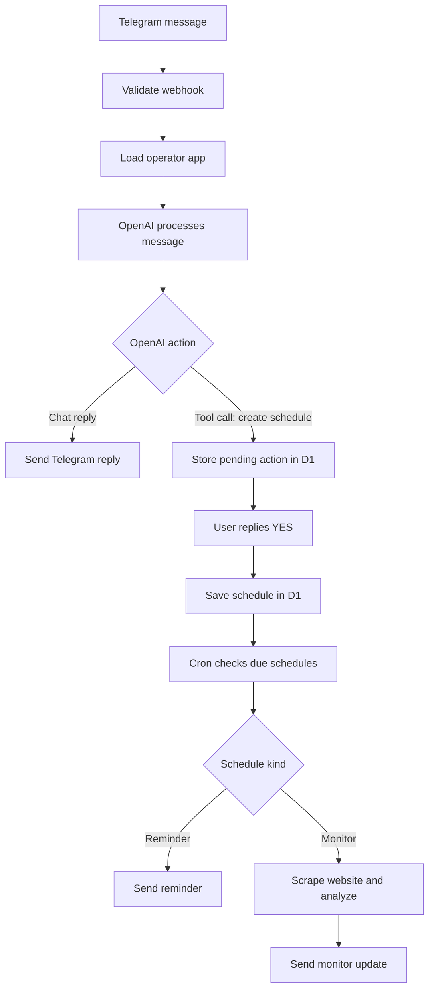

# switch-operator

`switch-operator` is a Cloudflare Worker-based Telegram operator. It exposes a
webhook-driven interface for OpenAI-backed replies,
persists reminder and monitoring schedules in Cloudflare D1, and executes due
jobs on a cron trigger.

The current feature set includes:

- Webhook authentication, request validation, and access control
- OpenAI-backed chat replies
- Scheduled reminders and recurring messages
- Website monitoring with Telegram notifications

## Tech Stack

- **Runtime:** Cloudflare Workers
- **Framework:** Hono
- **Language:** TypeScript (strict)
- **Messaging:** Telegram Bot API
- **LLM:** OpenAI API
- **Validation:** Zod
- **Monorepo:** pnpm workspaces

## Structure

```
apps/
  operator/     # Cloudflare Worker (Telegram bot)
packages/
  http-client/  # Shared fetch wrapper with response validation
  logger/       # Shared structured logger
tooling/
  eslint/       # Shared ESLint config
  prettier/     # Shared Prettier config
  typescript/   # Shared TypeScript config
```

## Flow



## Development

Requires Node 24.12.0 (see `.nvmrc`) and pnpm.

```sh
pnpm install          # install dependencies
pnpm dev              # start local dev server
pnpm build            # build all workspaces
pnpm typecheck        # type checking
pnpm lint             # linting
pnpm test             # run tests
pnpm format:check     # check formatting
pnpm format           # fix formatting
```

For local Telegram bot testing you also need
[cloudflared](https://developers.cloudflare.com/cloudflare-one/connections/connect-networks/downloads/)
to tunnel to your local worker. See
[apps/operator/README.md](apps/operator/README.md) for full setup instructions
(`.dev.vars`, D1 migrations, webhook registration, production secrets).
