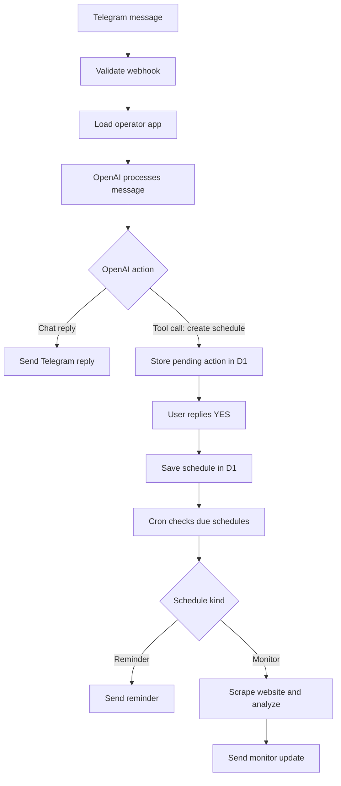

# switch-operator

`switch-operator` is a Cloudflare Worker-based Telegram operator. It exposes a
webhook-driven interface for OpenAI-backed replies,
persists reminder and monitoring schedules in Cloudflare D1, and executes due
jobs on a cron trigger.

The current feature set includes:

- Webhook authentication, request validation, and access control
- OpenAI-backed chat replies
- Scheduled reminders and recurring messages
- Website monitoring with Telegram notifications

## Tech Stack

- **Runtime:** Cloudflare Workers
- **Framework:** Hono
- **Language:** TypeScript (strict)
- **Messaging:** Telegram Bot API
- **LLM:** OpenAI API
- **Validation:** Zod
- **Monorepo:** pnpm workspaces + Turborepo
- **Tooling:** oxlint (type-aware), Prettier, Knip

## Structure

```
apps/
  operator/         # Cloudflare Worker (Telegram bot)
  browser-scraper/  # Cloudflare Worker (headless browser scraping)
  alerts/           # Cloudflare Worker (scheduled market alerts)
packages/
  alpha-vantage/    # Alpha Vantage market data client
  http-client/      # Shared fetch wrapper with response validation
  logger/           # Shared structured logger
  telegram/         # Telegram Bot API client
  url-validator/    # Safety policy checks for user-supplied URLs
tooling/
  github/           # CI setup action and gitleaks secrets scan
  prettier/         # Shared Prettier config
  typescript/       # Shared TypeScript config
```

## Flow


```mermaid
flowchart TD
  A[Telegram message] --> B[Validate webhook]
  B --> C[Load operator app]
  C --> D[OpenAI processes message]
  D --> E{OpenAI action}
  E -->|Chat reply| F[Send Telegram reply]
  E -->|Tool call: create schedule| G[Store pending action in D1]
  G --> H[User replies YES]
  H --> I[Save schedule in D1]
  I --> J[Cron checks due schedules]
  J --> K{Schedule kind}
  K -->|Reminder| L[Send reminder]
  K -->|Monitor| M[Scrape website and analyze]
  M --> N[Send monitor update]
```

## Development

Requires Node 24.21.0 (see `.nvmrc`) and pnpm 12 (see `packageManager`).

```sh
pnpm install          # install dependencies
pnpm dev              # start local dev server
pnpm build            # build all workspaces
pnpm typecheck        # type checking
pnpm lint             # oxlint
pnpm knip             # unused files, exports and dependencies
pnpm test             # run tests
pnpm secrets:scan     # gitleaks over git history
pnpm format:check     # check formatting
pnpm format           # fix formatting
```

For local Telegram bot testing you also need
[cloudflared](https://developers.cloudflare.com/cloudflare-one/connections/connect-networks/downloads/)
to tunnel to your local worker. See
[apps/operator/README.md](apps/operator/README.md) for full setup instructions
(`.dev.vars`, D1 migrations, webhook registration, production secrets).
